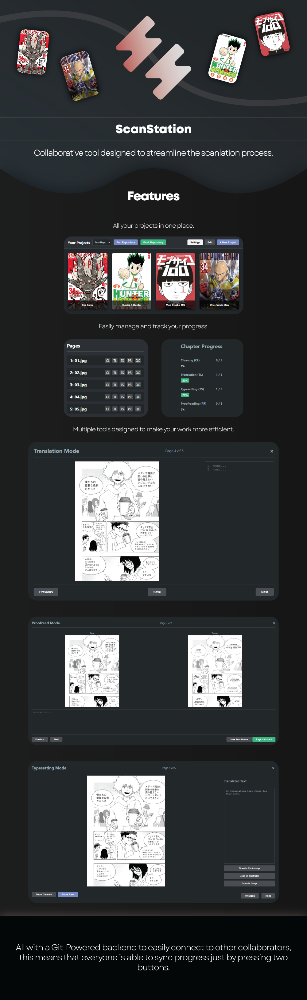

*This application was built with the extensive support of Gemini.*

---

## Requirements

Since ScanStation works directly with github backend, it needs git installed to work, and you also need to set your git identity. If you already have git installed on your computer, then you can skip this.

The program will prompt you to install git and set your identity on the first launch if needed.

After this is done, ScanStation will work properly.

---

## Setup

On your first launch ScanStation will ask you to choose a folder or leave the default one, choose and then
wait for the initial loading screen (green window) to close to complete the installation.

### Connecting to GitHub

Every collaborator must connect the app to their GitHub account using a Personal Access Token (PAT). While you can use your main GitHub account, I recommend creating a separate account dedicated to scanlations.

### Creating the Personal Access Token

1.  On the GitHub website, click your **profile picture** in the top-right corner, then select **Settings**.
2.  In the left sidebar, scroll down and click **Developer settings**.
3.  Click **Personal access tokens**, then select **Tokens (classic)**.
4.  Click **Generate new token**, and choose **Generate new token (classic)**.
5.  In the **title** field, give your token a descriptive name (e.g., "Scanstation Group").
6.  For **Expiration**, select your preferred timeframe.
7.  Check the box **repo**. This is the only permission required, as this will enable all collaborators to modify the projects repository.
8.  Scroll to the bottom and click **Generate token**.

### Adding the Token to Scanstation

1.  **Copy the newly generated token**. Be sure to save it somewhere safe, as you won't be able to see it again. In the case you lose the token, you will have to regenerate it.
2.  Open **Scanstation** and go to the **Settings** screen.
3.  Click **Set Token**, paste your token into the input field, and press **Save**.
4.  Scroll down and click **Done** to close the settings window.

---

## Setting Up the Repository
These steps explain how to create a shared GitHub repository and connect it to ScanStation.

### For the Repository Owner

1.  **Create the Repository**
    Go to GitHub and create a new repository with any name you choose. It's recommended to make it **private**.

2.  **Make an Initial Commit**
    The repository you just created cannot be used until it has at least one commit. From your new repository's main page, click **create a new file (displayed as creating a new file)**. A `README.md` file is a good choice for this. Add any text you like and commit the new file.

3.  **Invite Collaborators**
    Navigate to your repository's **Settings** tab. In the sidebar, click **Collaborators**. Click **Add people** and invite your team members using their GitHub usernames.  You can also add collaborators directly from the quick setup page.

### For Collaborators

* **Accept the Invitation**: You will receive an invitation via email and in your GitHub notifications. Click the link in the invitation to accept. You can see the invitation on your notifications tab from Github.

### For Everyone (Owner & Collaborators)

1.  **Copy the Repository URL**
    Navigate to the main page of the repository on GitHub. Click the green **<> Code** button and copy the **HTTPS** URL. It will look like this: `https://github.com/YourUsername/YourRepo.git`.

2.  **Add the Repository to Scanstation**
    Open Scanstation and go to **Settings**. Click **+ Add Repository**, paste the HTTPS link you copied, and click **Pull Files**.

You can now create projects in the repository. Remember that GitHub doesn't track empty folders, so you must add a file (like an image) to a new chapter folder before you can commit and push it. This problem is just for chapters, when you create projects, these projects will have the cover image, so github will be able to track them correctly.

* **Desktop Shortcut**: If you wish to create a desktop shortcut, a utility for this is available at the bottom of the **Settings** screen.

---

## Usage

1. Create a Project
All your work is organized into projects.

From the main screen, ensure the correct repository is selected in the dropdown menu.

Click + New Project.

Give your project a name and image.

2. Create a Chapter
Once you click on a project, you can add chapters to it.

From the project's chapter list, click + New Chapter.

Enter the chapter number and name.

ScanStation will automatically create the necessary folders inside your project's directory.

3. The Scanlation Workflow
This is the main workspace for editing and tracking page progress.

Add Raw Images: Place your raw manga pages into the Raws folder for the chapter you are working on. The sidebar will automatically populate with these pages.

Use the Views:

Click the Translate button to open the translation view. Here, you can write the script and draw on the image to mark bubbles. Your work is saved automatically.

Once pages are cleaned and placed in the Raws Cleaned folder, click the Typeset button. This view shows the cleaned page and the translated text, with buttons to open the image in an external editor like Photoshop.

After a page is typeset and placed in the Typesetted folder, click the Proofread button. This view shows a side-by-side comparison of the raw and typeset images for final checks. You can write corrections in the annotations box.

Track Progress: The sidebar on the right shows the status of every page (CL, TL, TS, PR, QC). The CL (Cleaned) and TS (Typeset) statuses update automatically when you add files to the corresponding folders.

Finalize a Page: In the Proofread view, clicking the "Page is Correct" button will copy the typeset file to the Final folder, ready for release.

4. Push Your Work
To share your progress and make your files available to collaborators, you must push your changes to the remote repository.

Navigate back to the main project screen.

Ensure the correct repository is selected.

Click the Push Repository button. The app will sync your local changes with the remote repository.

---
## Disclaimer
This app is in its first stage, and it is heavily recommended that you keep track of all your files before working with it. The app automatically creates a backup of all repositories in a `backup` folder located next to your main projects folder (e.g., `.../Scanstation/backup`).

## Kofi
If you wish to donate I would be extremely grateful :D
https://ko-fi.com/sifonezz